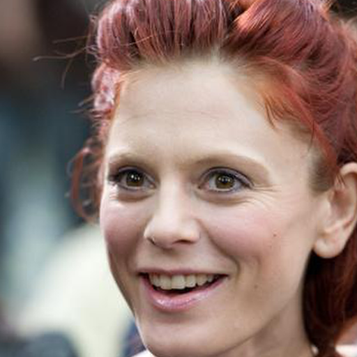

# <p align="center"> HD CelebA Cropper

[CelebA](http://mmlab.ie.cuhk.edu.hk/projects/CelebA.html) dataset provides an aligned set `img_align_celeba.zip`. However, the size of each aligned image is **218x178**, so the faces cropped from such images would be even smaller!

Here we provide a code to obtain **higher resolution** face images, by cropping the faces from the original unaligned images via 5 landmarks.

***We also use a [deep image quality assessment](https://github.com/dmaniry/deepIQA) method to evaluate and rank the cropped image quality in [scores.txt](scores.txt), lower score the better.***

## Cropped Faces (512x512)

***Notice***: There are still some low resolution cropped faces since the corresponding original images are low resolution.

<p align="center">
 
 
</p>

## Usage

- Prerequisites
    - OpenCV 3 (much faster) or scikit-image
    - Python 2 or 3

- Dataset
    - download the dataset
        - **img_celeba.7z**
            - https://pan.baidu.com/s/1eSNpdRG#list/path=%2FCelebA%2FImg or
            - https://drive.google.com/drive/folders/0B7EVK8r0v71pTUZsaXdaSnZBZzg
        - **list_landmarks_celeba.txt**
            - https://pan.baidu.com/s/1eSNpdRG#list/path=%2FCelebA%2FAnno&parentPath=%2F or
            - https://drive.google.com/drive/folders/0B7EVK8r0v71pOC0wOVZlQnFfaGs
    - unzip the data

        ```console
        7z x img_celeba.7z.001
        ```

    - organize the files as follow

        ```
        path_to_dataset
        ├── data/*.jpg
        └── list_landmarks_celeba.txt
        ```

- Examples

    - 512x512 + lanczos4 (with OpenCV) + jpg

        ```console
        python hd_celeba.py --data_dir path_to_dataset --crop_size 512 --order 4 --save_format jpg --n_worker 32
        ```
        <p align="center">  </p>

    - 512x512 + lanczos4 (with OpenCV) + png + larger face in the image (by setting `face_factor`, default is 0.7)

        ```console
        python hd_celeba.py --data_dir path_to_dataset --crop_size 512 --order 4 --save_format png --face_factor 0.8 --n_worker 32
        ```
        <p align="center">   </p>

    - 384x384 + bicubic + jpg + smaller face in the image (by setting `face_factor`, default is 0.7)

        ```console
        python hd_celeba.py --data_dir path_to_dataset --crop_size 384 --order 3 --save_format jpg --face_factor 0.65 --n_worker 32
        ```
        <p align="center">   </p>

- Notice
    - `order` for OpenCV
        - 0: INTER_NEAREST
        - 1: INTER_LINEAR
        - 2: INTER_AREA
        - 3: INTER_CUBIC
        - 4: INTER_LANCZOS4
        - 5: INTER_LANCZOS4
    - `order` for scikit-image
        - 0: Nearest-neighbor
        - 1: Bi-linear
        - 2: Bi-quadratic
        - 3: Bi-cubic
        - 4: Bi-quartic
        - 5: Bi-quintic
