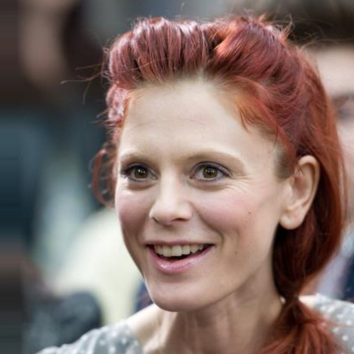

# <p align="center"> HD CelebA Cropper

[CelebA](http://mmlab.ie.cuhk.edu.hk/projects/CelebA.html) dataset provides an aligned set `img_align_celeba.zip`. However, the size of each aligned image is **218x178**, so the faces cropped from such images would be even smaller!

Here we provide a code to obtain **higher resolution** face images, by cropping the faces from the original unaligned images via 68 landmarks.

***We also use a [deep image quality assessment](https://github.com/dmaniry/deepIQA) method to evaluate and rank the cropped image quality in [scores.txt](scores.txt), lower score the better.***

## Cropped Faces (512x512)

***Notice***: There are still some low resolution cropped faces since the corresponding original images are low resolution.

<p align="center">
 
 
</p>

## Usage

- Prerequisites

    - OpenCV

    - Python 3.6

- Dataset

    - [CelebA](http://openaccess.thecvf.com/content_iccv_2015/papers/Liu_Deep_Learning_Face_ICCV_2015_paper.pdf)-unaligned (10.2GB, higher quality than the aligned data)

        - download the dataset

            - img_celeba.7z (move to **./data/img_celeba.7z**): [Google Drive](https://drive.google.com/drive/folders/0B7EVK8r0v71pTUZsaXdaSnZBZzg) or [Baidu Netdisk](https://pan.baidu.com/s/1CRxxhoQ97A5qbsKO7iaAJg) (password rp0s)

            - annotations.zip (move to **./data/annotations.zip**): [Google Drive](https://drive.google.com/file/d/1xd-d1WRnbt3yJnwh5ORGZI3g-YS-fKM9/view?usp=sharing)

        - unzip the data

            ```console
            7z x ./data/img_celeba.7z/img_celeba.7z.001 -o./data/

            unzip ./data/annotations.zip -d ./data/
            ```

- Cropping Examples

    - 512x512 + lanczos4 + jpg

        ```console
        python align.py --crop_size_h 512 --crop_size_w 512 --order 4 --save_format jpg --n_worker 32
        ```

        <p align="center">  </p>

    - 512x512 + lanczos4 + png + larger face in the image (by setting `face_factor`, default is 0.45)

        ```console
        python align.py --crop_size_h 512 --crop_size_w 512 --order 4 --save_format png --face_factor 0.6 --n_worker 32
        ```

        <p align="center">   </p>

    - 384x384 + bicubic + jpg + smaller face in the image (by setting `face_factor`, default is 0.45)

        ```console
        python align.py --crop_size_h 384 --crop_size_w 384 --order 3 --save_format jpg --face_factor 0.3 --n_worker 32
        ```

        <p align="center">   </p>

- Notice

    - `order`

        - 0: INTER_NEAREST

        - 1: INTER_LINEAR

        - 2: INTER_AREA

        - 3: INTER_CUBIC

        - 4: INTER_LANCZOS4

        - 5: INTER_LANCZOS4

